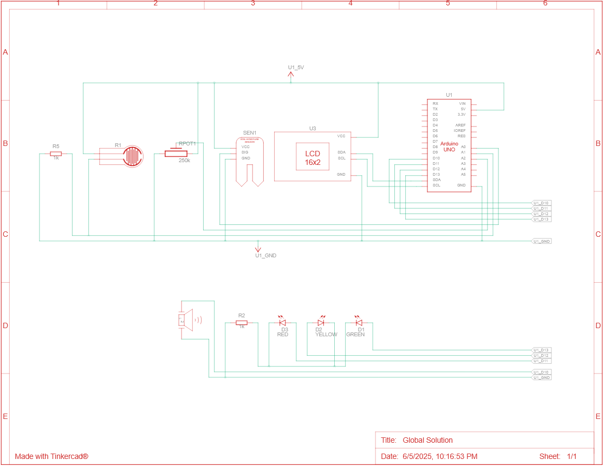
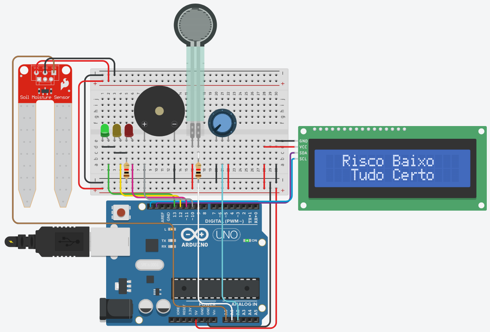

# 🌧️ AlertaBairro – Sistema IoT de Monitoramento de Enchentes

O **AlertaBairro** é um sistema embarcado baseado em Arduino que monitora variáveis ambientais críticas — como umidade do solo, umidade do ar e intensidade da chuva — para **detectar riscos de enchente**. Com o uso de sensores analógicos, LEDs indicadores e um display LCD, o sistema fornece alertas visuais e sonoros em três níveis: **normal**, **alerta** e **perigo**.

---

## 👨‍💻 Membros do Grupo

- **Diogo Oliveira Lima** - RM: 562559  
- **Lucas dos Reis Aquino** - RM: 562414  
- **Lucas Perez Bonato** - RM: 565356

## 🛠 TinkerCad: 

 - [Projeto](https://www.tinkercad.com/things/eqazHuI6MxB-global-solution/editel?returnTo=https%3A%2F%2Fwww.tinkercad.com%2Fdashboard)

## 🎥 Youtube: 
 - [Video](https://www.youtube.com/watch?v=5TrXFqfH2YI)

## 📸 Imagens

| Esquemática do circuito                          |
| ------------------------------------------------ |
|                 |

| Protótipo físico                                 |
| ------------------------------------------------ |
|                      |

---

## 🚀 Funcionalidades

* Monitora:

  * 💧 Umidade do solo
  * 💦 Umidade do ar (simulada com potenciômetro)
  * 🌧️ Intensidade da chuva (simulada com sensor de força)
* Exibe o nível de risco em um LCD 16x2:

  * ✅ **Risco Baixo**: ambiente seguro
  * ⚠️ **Alerta**: variações detectadas, atenção necessária
  * 🚨 **Perigo**: condições críticas, possível enchente
* Ativa LEDs e buzzer de acordo com o risco:

  * Verde: seguro
  * Amarelo: alerta
  * Vermelho + Buzzer: perigo

---

## 🧠 Lógica de Funcionamento

O sistema realiza a leitura contínua dos sensores e classifica os valores em três faixas:

| Sensor              | Alerta (⚠️) | Perigo (🚨) |
| ------------------- | ----------- | ----------- |
| Umidade do Solo (%) | ≥ 33        | ≥ 66        |
| Umidade do Ar (%)   | ≥ 33        | ≥ 66        |
| Força da Chuva (N)  | ≥ 3         | ≥ 6         |

A cada segundo, o sistema avalia os dados e atualiza os indicadores e mensagens no LCD.

---

## 🧩 Componentes Utilizados

| Quantidade | Nome                            | Descrição                         |
| ---------- | ------------------------------- | --------------------------------- |
| 1          | Arduino Uno R3                  | Microcontrolador principal        |
| 1          | Sensor de Umidade Solo          | Detecta umidade no solo           |
| 1          | Sensor de Força                 | Simula a intensidade da chuva     |
| 1          | Potenciômetro 250 kΩ            | Simula umidade do ar              |
| 1          | LCD 16x2 (I2C - 0x27)           | Exibe mensagens e níveis de risco |
| 3          | LEDs (Verde, Amarelo, Vermelho) | Indicadores visuais de risco      |
| 2          | Resistores 1 kΩ                 | Para os LEDs                      |
| 1          | Buzzer Piezoelétrico            | Emite som em caso de perigo       |

---

## 🔧 Como Usar

1. Monte o circuito conforme o esquema eletrônico.
2. Faça o upload do código para o Arduino Uno usando a IDE do Arduino.
3. Abra o monitor serial (9600 baud) para acompanhar as leituras dos sensores.
4. Observe os LEDs, buzzer e mensagens no display conforme os sensores detectam mudanças.

---

## 📌 Observações

* O projeto foi desenvolvido com foco em **baixo custo e operação local**, ideal para áreas com acesso limitado à internet.
* Sensores analógicos simulam as variáveis ambientais — podendo ser substituídos por sensores reais em futuras versões.
